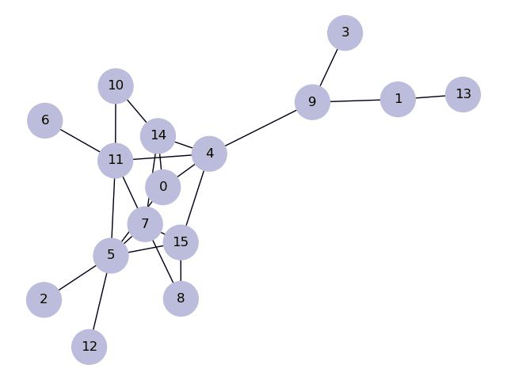

# math6010
Follow the commands below to start.
    
    git clone https://github.com/sszxc/MATH6010-homework.git
    cd MATH6010-homework/
    python -m pip install -r requirements.txt

## Homework 1: Minimum Dominating Set

 Write a program that finds the minimum dominating set of a graph using greedy approach.

