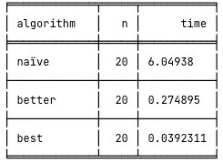
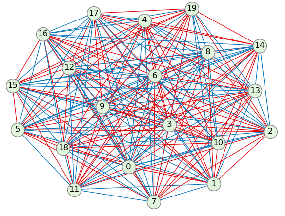
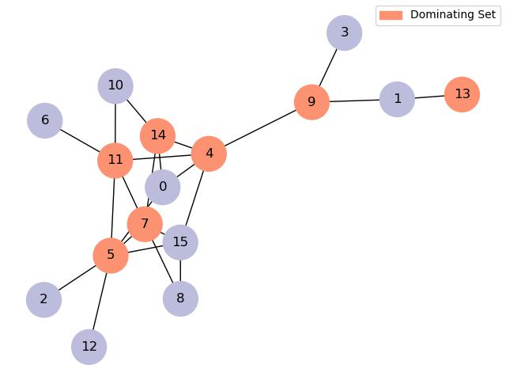
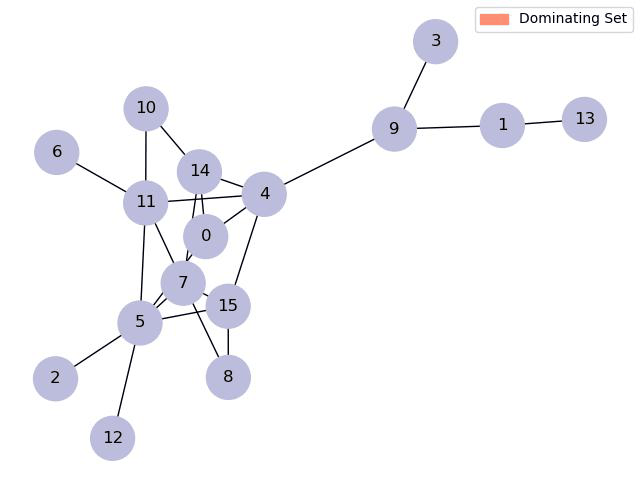

# Math6010
Three homeworks till now. Hw1 for greedy approach, Hw2 for derandomized approach, Hw3 for heuristic algorithm.

Follow the commands below to start.
    
    git clone git@github.com:merak0514/Math6010.git
    python3 -m pip install -r requirements.txt

## Homework 3: Balanced graph partitioning, heuristic algorithm

Given a complete graph $G(V,E)$ with $|V|=2n$, 
and a mapping of cost $C:V\times{V}\rightarrow\mathbb{R}$. 
Find a 2-partition of the graph, such that each partition has $n$ vertex,
and the total cost of those edges whose vertexes
are in the different partitions is minimized.

$$\begin{aligned}
min \quad &c([X_0,X_1]) = \sum_{\{u,v\}\in E,u\in X_0,v\in X_1}cost(u,v)\newline
s.t. \quad &V = X_0 \cup X_1 \,and \,|X_0| = |X_1| = n
\end{aligned}$$

## Homework 2: Two-coloring of Kn, derandomized algorithm

Kn is a complete graph (a clique) with n nodes. 

Theorem: There is a two-coloring of Kn with at most Cn4 * 2-5 monochromatic K4.

Write a program to find the solution, using the **derandomization algorithm**.

    python3 hw2/main.py

There are three different solutions.

Visualization of the solution.

## Homework 1: Minimum Dominating Set, a greedy approach

 Write a program that finds the minimum dominating set of a graph using **greedy approach**.

    python3 hw1/main.py

